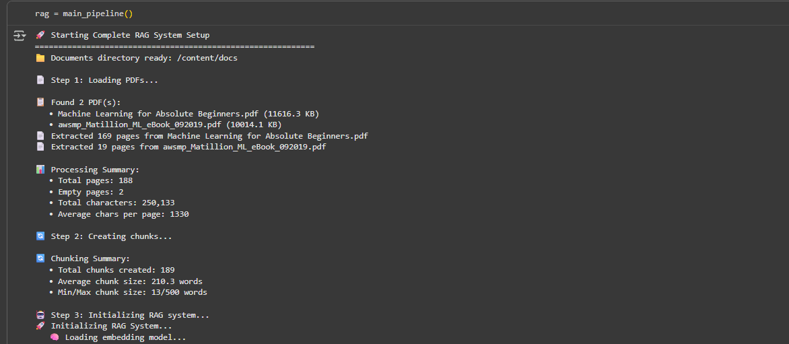
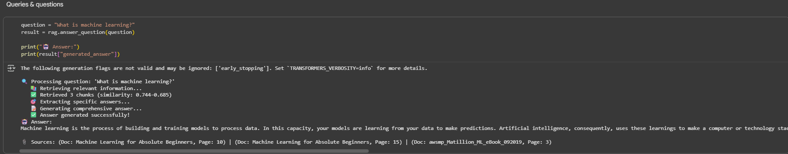

# Mini AI RAG chat 
Steps are easy to follow 

# 📱 Mini AI RAG Chat App

An interactive **RAG-based document Q&A app** built with **Python + Jupyter/Gradio**.  
Upload PDFs → Build embeddings → Ask questions → Get answers with both **extractive** and **generative** models.

## Download the notebook file

- **Open google colab**: use the notebook exaactly as i provided and run in step by step manner of cells

**Turn the free GPU provided from colab activate the runtime**

- **Download the smaples i provided**:  in **Sample_Pdfs** folder

- **Make sure the pdfs are in the colab drive in the left panel** 

### Method I Followed

| Step                | Status   | Description |
|---------------------|----------|-------------|
| PDF Ingestion       | ✅       | Extracted text from uploaded PDFs using `pypdf`, with cleaning and normalization. |
| Text Chunking       | ✅       | Split text into overlapping chunks (500 tokens with 100 overlap) for better retrieval. |
| Embeddings          | ✅       | Generated embeddings using `sentence-transformers/all-MiniLM-L6-v2`. |
| Vector Index (FAISS)| ✅       | Stored embeddings in a FAISS index for similarity search. |
| Retrieval           | ✅       | Retrieved top-k most relevant chunks per query. |
| QA Models           | ✅       | Used DistilBERT for extractive answers and Flan-T5 for generative answers. |
| Interactive UI      | ✅       | Built a Gradio interface for uploading PDFs and asking questions. |

## 📸 Screenshots

